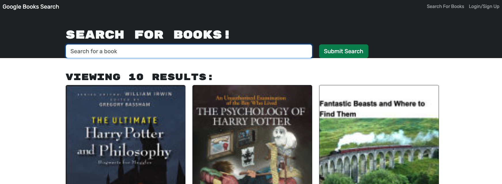

# Clarence's Portfolio 

## Book Search Engine

This is a Google Search Book Engine built on the MERN stack using GraphQL.

## Table of Contents

- [Installation](#installation)
- [Technology](#technology)
- [License](#license)

## Installation

To run the necessary dependencies, run:

`npm i`

To seed the database, run the follow command:

`npm run seed`

## Deployment Link

URL to deployed application:
https://clarence-book-search-engine-8c5999af6262.herokuapp.com/

## Technology 

- MERN stack
- MongoDB
- GraphQL

## License

MIT License

